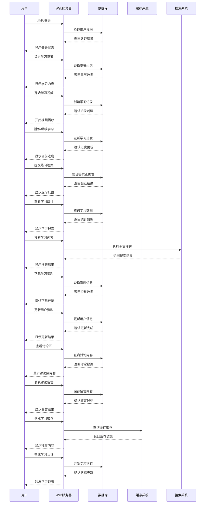

# 视频学习网站数据库时序图



## 时序图说明

### 1. 核心数据库交互流程

#### 1.1 用户认证流程
- **注册/登录** → **验证凭据** → **返回认证结果** → **显示登录状态**

#### 1.2 学习内容获取
- **请求章节** → **查询内容** → **返回数据** → **显示内容**

#### 1.3 学习进度管理
- **开始学习** → **创建记录** → **确认创建** → **开始播放**
- **暂停/继续** → **更新进度** → **确认更新** → **显示进度**

#### 1.4 练习与评估
- **提交答案** → **验证正确性** → **返回结果** → **显示反馈**

#### 1.5 学习统计
- **查看统计** → **查询数据** → **返回统计** → **显示报告**

### 2. 系统组件职责

#### 2.1 Web服务器 (W)
- 处理用户请求
- 协调数据库操作
- 管理用户会话
- 提供API接口

#### 2.2 数据库 (DB)
- 存储用户数据
- 管理学习内容
- 记录学习进度
- 保存用户反馈

#### 2.3 缓存系统 (C)
- 缓存常用数据
- 加速推荐系统
- 减少数据库负载

#### 2.4 搜索系统 (S)
- 提供全文搜索
- 索引学习内容
- 优化搜索性能

### 3. 数据流管理

#### 3.1 用户数据流
```
用户注册 → 数据库存储 → 会话管理 → 认证授权
```

#### 3.2 学习数据流
```
学习内容 → 数据库查询 → 缓存加速 → 用户展示
学习进度 → 数据库记录 → 实时更新 → 统计分析
```

#### 3.3 反馈数据流
```
用户练习 → 数据库验证 → 结果反馈 → 进度更新
用户反馈 → 数据库保存 → 数据分析 → 系统改进
```

### 4. 关键数据库操作

#### 4.1 用户表操作
```sql
-- 用户注册
INSERT INTO users (username, email, password) VALUES (...);

-- 用户登录
SELECT * FROM users WHERE email = ? AND password = ?;

-- 更新用户信息
UPDATE users SET profile = ? WHERE user_id = ?;
```

#### 4.2 学习内容操作
```sql
-- 查询章节内容
SELECT * FROM chapters WHERE chapter_id = ?;

-- 获取视频信息
SELECT * FROM videos WHERE video_id = ?;

-- 获取代码示例
SELECT * FROM code_examples WHERE chapter_id = ?;
```

#### 4.3 学习进度操作
```sql
-- 创建学习记录
INSERT INTO learning_records (user_id, chapter_id, start_time) VALUES (...);

-- 更新学习进度
UPDATE learning_records SET progress = ?, last_time = ? WHERE record_id = ?;

-- 查询学习统计
SELECT COUNT(*) as completed FROM learning_records WHERE user_id = ? AND status = 'completed';
```

#### 4.4 练习操作
```sql
-- 验证练习答案
SELECT * FROM exercises WHERE exercise_id = ? AND correct_answer = ?;

-- 记录练习结果
INSERT INTO exercise_results (user_id, exercise_id, answer, is_correct) VALUES (...);
```

### 5. 性能优化策略

#### 5.1 数据库索引
- 用户表：email, username 索引
- 学习记录：user_id, chapter_id 索引
- 练习结果：user_id, exercise_id 索引

#### 5.2 缓存策略
- 热门章节内容缓存
- 用户学习进度缓存
- 推荐内容缓存

#### 5.3 读写分离
- 读操作使用从库
- 写操作使用主库
- 实时数据同步

### 6. 数据安全考虑

#### 6.1 数据加密
- 用户密码加密存储
- 敏感信息加密传输
- 数据备份加密

#### 6.2 访问控制
- 用户权限管理
- 数据操作权限控制
- 敏感数据访问限制

#### 6.3 数据备份
- 定期数据备份
- 异地容灾备份
- 数据恢复机制

### 7. 扩展性设计

#### 7.1 水平扩展
- 数据库分库分表
- 缓存集群部署
- 负载均衡配置

#### 7.2 垂直扩展
- 字段扩展预留
- 索引优化空间
- 查询性能优化

### 8. 监控与维护

#### 8.1 性能监控
- 数据库查询性能监控
- 缓存命中率监控
- 系统响应时间监控

#### 8.2 数据质量
- 数据完整性检查
- 数据一致性验证
- 异常数据处理

## 总结

这个时序图展示了视频学习网站的核心数据库交互流程，确保了用户数据和学习数据的高效管理。通过合理的组件分工、性能优化策略和安全考虑，网站能够提供稳定可靠的学习服务，同时具备良好的扩展性和可维护性。