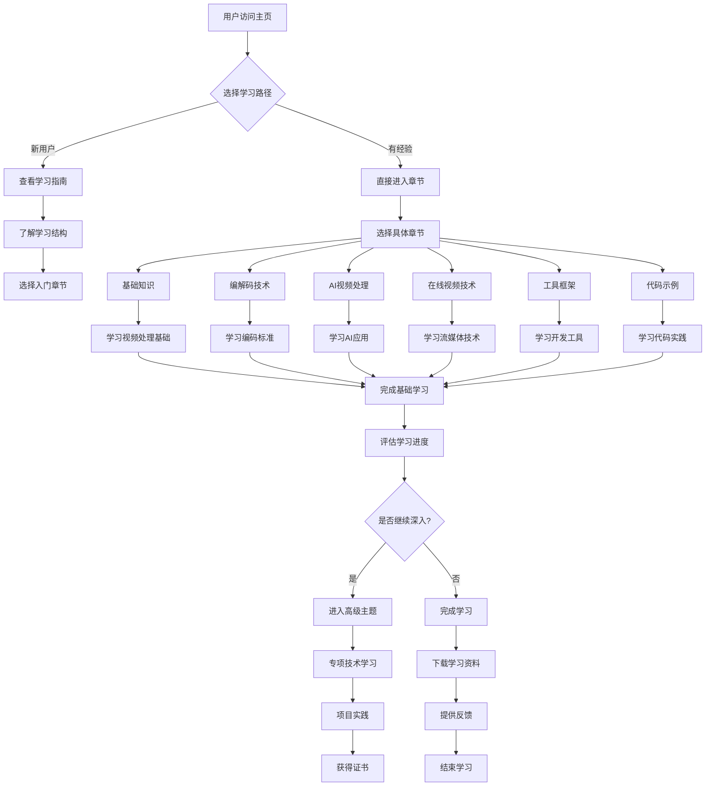

# 视频学习网站主页流程图

## 流程图说明

### 1. 用户入口
- **A[用户访问主页]**：用户进入网站的起点
- **B{选择学习路径}**：根据用户经验提供不同路径

### 2. 学习路径分支
- **新用户路径**：
  - 查看学习指南 → 了解学习结构 → 选择入门章节
- **有经验用户路径**：
  - 直接进入章节 → 选择具体学习内容

### 3. 主要学习章节
- **基础知识**：视频处理基础理论
- **编解码技术**：主流编码标准对比
- **AI视频处理**：深度学习应用
- **在线视频技术**：流媒体协议
- **工具框架**：开发工具详解
- **代码示例**：实际代码实践

### 4. 学习完成流程
- **评估学习进度**：检查学习完成情况
- **继续深入**：进入高级主题或专项学习
- **完成学习**：下载资料、提供反馈

### 5. 高级学习路径
- **专项技术学习**：深入某个技术领域
- **项目实践**：实际项目开发
- **获得证书**：完成学习认证

## 设计原则

1. **渐进式学习**：从基础到高级的循序渐进
2. **个性化路径**：根据用户经验提供不同路径
3. **多维度评估**：学习进度和知识掌握程度
4. **实践导向**：理论结合实际代码示例
5. **完整闭环**：从学习到实践到认证的完整流程

## 用户体验优化

- **清晰导航**：用户始终知道自己的位置和下一步
- **进度跟踪**：实时显示学习进度
- **自适应路径**：根据学习行为调整推荐内容
- **反馈机制**：用户可以提供学习体验反馈