# 视频学习网站章节组织树图

```mermaid
graph TD
    A[视频处理技术学习] --> B[基础知识]
    A --> C[编解码技术]
    A --> D[AI视频处理]
    A --> E[在线视频技术]
    A --> F[工具框架]
    A --> G[代码示例]
    
    B --> B1[色彩空间与图像处理]
    B --> B2[运动估计与补偿]
    B --> B3[视频质量评价]
    B --> B4[视频处理基础算法]
    
    C --> C1[主流编码标准对比]
    C --> C2[H.264/AVC详解]
    C --> C3[H.265/HEVC详解]
    C --> C4[AV1编解码技术]
    C --> C5[VP9编码标准]
    C --> C6[编码优化技术]
    
    D --> D1[深度学习基础]
    D --> D2[视频超分辨率]
    D --> D3[视频生成技术]
    D --> D4[视频分析与理解]
    D --> D5[视频增强技术]
    
    E --> E1[直播技术原理]
    E --> E2[点播技术架构]
    E --> E3[流媒体协议详解]
    E --> E4[CDN内容分发]
    E --> E5[自适应码率技术]
    
    F --> F1[FFmpeg详解]
    F --> F2[OpenCV视频处理]
    F --> F3[PyTorch Video]
    F --> F4[视频处理库对比]
    F --> F5[开发工具链]
    
    G --> G1[Python视频处理]
    G --> G2[Golang视频处理]
    G --> G3[实际项目案例]
    G --> G4[代码优化技巧]
    G --> G5[调试与测试]
    
    B1 --> B1a[RGB色彩空间]
    B1 --> B1b[YUV色彩空间]
    B1 --> B1c[色彩空间转换]
    B1 --> B1d[色度抽样]
    
    B2 --> B2a[运动估计原理]
    B2 --> B2b[块匹配算法]
    B2 --> B2c[运动补偿技术]
    B2 --> B2d[运动矢量编码]
    
    B3 --> B3a[主观评价方法]
    B3 --> B3b[客观评价指标]
    B3 --> B3c[视频质量评估工具]
    
    B4 --> B4a[滤波算法]
    B4 --> B4b[变换编码]
    B4 --> B4c[量化技术]
    B4 --> B4d[熵编码]
    
    C1 --> C1a[编码复杂度对比]
    C1 --> C1b[压缩效率对比]
    C1 --> C1c[适用场景分析]
    
    C2 --> C2a[帧类型划分]
    C2 --> C2b[熵编码技术]
    C2 --> C2c[环路滤波]
    C2 --> C2d[多参考帧]
    
    C3 --> C3a[最大变换尺寸]
    C3 --> C3b[高效熵编码]
    C3 --> C3c[并行化处理]
    C3 --> C3d[屏幕内容编码]
    
    C4 --> C4a[开源架构]
    C4 --> C4b[帧内预测]
    C4 --> C4c[帧间预测]
    C4 --> C4d[滤波技术]
    
    D1 --> D1a[卷积神经网络]
    D1 --> D1b[循环神经网络]
    D1 --> D1c[生成对抗网络]
    D1 --> D1d[Transformer模型]
    
    D2 --> D2a[SRCNN算法]
    D2 --> D2b[EDSR模型]
    D2 --> D2c[视频超分框架]
    D2 --> D2d[实时超分技术]
    
    D3 --> D3a[视频帧生成]
    D3 --> D3b[视频补全技术]
    D3 --> D3c[视频风格迁移]
    D3 --> D3d[视频预测技术]
    
    E1 --> E1a[推流与拉流]
    E1 --> E1b[实时编码]
    E1 --> E1c[延迟控制]
    E1 --> E1d[流媒体服务器]
    
    E2 --> E2a[文件格式]
    E2 --> E2b[索引结构]
    E2 --> E2c[播放器架构]
    E2 --> E2d[DRM版权保护]
    
    E3 --> E3a[HLS协议]
    E3 --> E3b[DASH协议]
    E3 --> E3c[RTMP协议]
    E3 --> E3d[WebRTC协议]
    
    F1 --> F1a[基本用法]
    F1 --> F1b[滤镜处理]
    F1 --> F1c[编码参数]
    F1 --> F1d[流媒体处理]
    
    F2 --> F2a[视频读写]
    F2 --> F2b[图像处理]
    F2 --> F2c[特征提取]
    F2 --> F2d[对象检测]
    
    G1 --> G1a[OpenCV基础]
    G1 --> G1b[FFmpeg封装]
    G1 --> G1c[视频处理实战]
    G1 --> G1d[性能优化]
    
    G2 --> G2a[FFmpeg-go]
    G2 --> G2b[视频流处理]
    G2 --> G2c[并发优化]
    G2 --> G2d[微服务架构]
```

## 树图说明

### 1. 知识体系结构

#### 1.1 总览
- **视频处理技术学习**：整个学习体系的根节点
- **六大主模块**：基础知识、编解码技术、AI视频处理、在线视频技术、工具框架、代码示例

#### 1.2 基础知识 (B)
- **色彩空间与图像处理**：视频处理的基础理论
- **运动估计与补偿**：视频编码的核心技术
- **视频质量评价**：评估视频处理效果的方法
- **视频处理基础算法**：各种处理算法的原理

#### 1.3 编解码技术 (C)
- **主流编码标准对比**：H.264、H.265、AV1、VP9等
- **H.264/AVC详解**：最广泛使用的编码标准
- **H.265/HEVC详解**：下一代编码标准
- **AV1编解码技术**：新兴开源编码标准
- **编码优化技术**：提高编码效率的技术

#### 1.4 AI视频处理 (D)
- **深度学习基础**：AI视频处理的基础理论
- **视频超分辨率**：提高视频清晰度的技术
- **视频生成技术**：生成新视频的技术
- **视频分析与理解**：理解视频内容的技术
- **视频增强技术**：改善视频质量的技术

#### 1.5 在线视频技术 (E)
- **直播技术原理**：实时视频传输技术
- **点播技术架构**：点播视频服务架构
- **流媒体协议详解**：各种流媒体协议
- **CDN内容分发**：内容分发网络技术
- **自适应码率技术**：根据网络自适应的技术

#### 1.6 工具框架 (F)
- **FFmpeg详解**：最流行的视频处理工具
- **OpenCV视频处理**：计算机视觉库
- **PyTorch Video**：深度学习视频处理
- **视频处理库对比**：各种库的对比分析
- **开发工具链**：完整的开发工具

#### 1.7 代码示例 (G)
- **Python视频处理**：Python语言示例
- **Golang视频处理**：Golang语言示例
- **实际项目案例**：实际项目的代码
- **代码优化技巧**：优化代码性能的方法
- **调试与测试**：代码调试和测试方法

### 2. 学习路径设计

#### 2.1 推荐学习顺序
1. **基础知识** → **编解码技术** → **AI视频处理**
2. **在线视频技术** → **工具框架** → **代码示例**

#### 2.2 知识递进关系
- **基础理论** → **具体技术** → **实际应用**
- **编码标准** → **优化技术** → **实现方法**
- **AI理论** → **具体模型** → **应用案例**

### 3. 知识点细分

#### 3.1 基础知识细分
- **色彩空间**：RGB、YUV、色彩空间转换
- **运动估计**：块匹配算法、运动补偿
- **视频质量**：主观评价、客观指标
- **基础算法**：滤波、变换、量化、熵编码

#### 3.2 编解码技术细分
- **编码标准**：复杂度对比、压缩效率对比
- **H.264**：帧类型、熵编码、环路滤波
- **H.265**：最大变换、高效熵编码
- **AV1**：开源架构、帧内预测、帧间预测

#### 3.3 AI视频处理细分
- **深度学习**：CNN、RNN、GAN、Transformer
- **超分辨率**：各种算法模型
- **视频生成**：帧生成、补全、风格迁移
- **视频分析**：理解视频内容的技术

#### 3.4 在线视频技术细分
- **直播**：推流拉流、实时编码、延迟控制
- **点播**：文件格式、索引结构、DRM保护
- **协议**：HLS、DASH、RTMP、WebRTC
- **CDN**：内容分发网络

#### 3.5 工具框架细分
- **FFmpeg**：基本用法、滤镜、编码参数
- **OpenCV**：视频读写、图像处理、特征提取
- **PyTorch Video**：深度学习视频处理
- **开发工具**：完整工具链

#### 3.6 代码示例细分
- **Python**：OpenCV基础、FFmpeg封装
- **Golang**：FFmpeg-go、视频流处理
- **项目案例**：实际项目代码
- **优化技巧**：性能优化、调试测试

### 4. 教学设计原则

#### 4.1 由浅入深
- 从基础理论开始
- 逐步深入到具体技术
- 最终达到实际应用

#### 4.2 理论结合实践
- 每个知识点都有理论讲解
- 配有相应的代码示例
- 有实际项目案例

#### 4.3 循序渐进
- 知识点之间有清晰的递进关系
- 学习路径合理规划
- 难度逐步增加

### 5. 学习资源规划

#### 5.1 理论资源
- 详细的文档说明
- 清晰的图表展示
- 深入的原理分析

#### 5.2 实践资源
- 完整的代码示例
- 可运行的项目
- 详细的注释说明

#### 5.3 评估资源
- 练习题和测验
- 实践项目
- 学习进度跟踪

## 总结

这个树图展示了视频学习网站完整的知识体系结构，从总体的学习目标到具体的知识点，形成了一个清晰的层次结构。通过合理的知识组织和学习路径设计，用户可以系统地掌握视频处理技术。