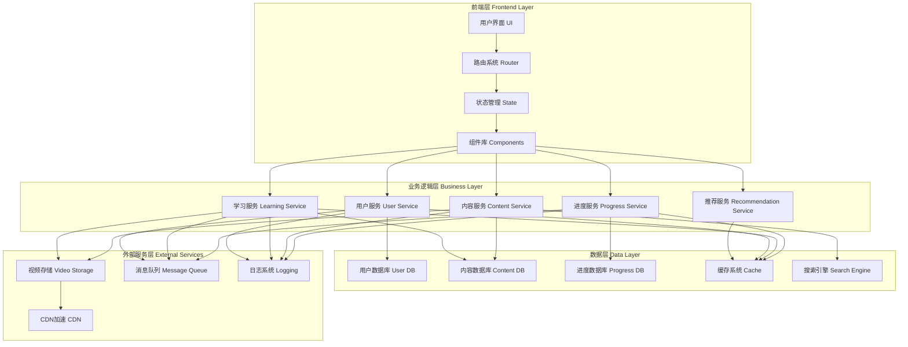
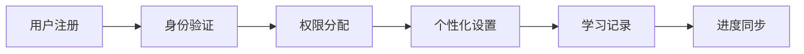
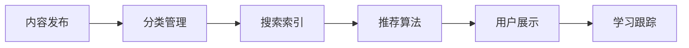
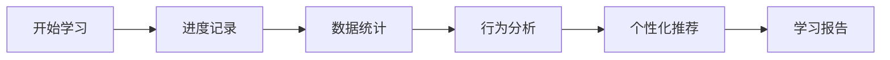
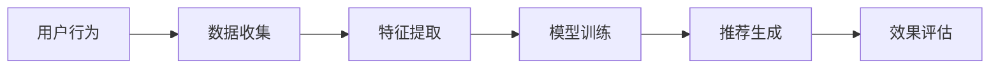

# 重构后的网站架构图



## 架构图说明

### 1. 四层架构设计

#### 1.1 前端层 (Frontend Layer)
- **用户界面 (UI)**：响应式设计，支持多种设备
- **路由系统 (Router)**：管理页面导航和状态
- **状态管理 (State)**：全局状态管理，数据同步
- **组件库 (Components)**：可复用的UI组件

#### 1.2 业务逻辑层 (Business Layer)
- **用户服务 (User Service)**：用户认证、权限管理
- **学习服务 (Learning Service)**：学习内容管理、进度跟踪
- **内容服务 (Content Service)**：内容发布、搜索、推荐
- **进度服务 (Progress Service)**：学习进度记录、统计分析
- **推荐服务 (Recommendation Service)**：个性化推荐算法

#### 1.3 数据层 (Data Layer)
- **用户数据库 (User DB)**：用户信息、权限数据
- **内容数据库 (Content DB)**：学习内容、视频资料
- **进度数据库 (Progress DB)**：学习进度、统计数据
- **缓存系统 (Cache)**：Redis缓存，加速访问
- **搜索引擎 (Search Engine)**：全文搜索、内容索引

#### 1.4 外部服务层 (External Services)
- **视频存储 (Video Storage)**：视频文件存储服务
- **CDN加速 (CDN)**：内容分发网络，全球加速
- **消息队列 (Message Queue)**：异步任务处理
- **日志系统 (Logging)**：系统日志、用户行为分析

### 2. 核心功能模块

#### 2.1 用户管理模块


#### 2.2 学习内容模块


#### 2.3 进度管理模块


#### 2.4 推荐系统模块


### 3. 技术架构选型

#### 3.1 前端技术栈
- **框架**：React/Vue.js
- **状态管理**：Redux/Vuex
- **路由**：React Router/Vue Router
- **UI组件**：Ant Design/Element UI
- **图表**：ECharts/D3.js

#### 3.2 后端技术栈
- **语言**：Python/Go/Java
- **框架**：Django/Gin/Spring Boot
- **API**：RESTful API/GraphQL
- **认证**：JWT/OAuth2.0

#### 3.3 数据库技术栈
- **关系数据库**：MySQL/PostgreSQL
- **文档数据库**：MongoDB
- **缓存数据库**：Redis
- **搜索引擎**：Elasticsearch

#### 3.4 基础设施
- **容器化**：Docker
- **编排**：Kubernetes
- **CI/CD**：GitLab CI/Jenkins
- **监控**：Prometheus + Grafana

### 4. 数据流程设计

#### 4.1 用户学习流程
```
用户登录 → 选择课程 → 播放视频 → 记录进度 → 完成练习 → 更新统计 → 获得认证
```

#### 4.2 内容管理流程
```
内容创建 → 审核发布 → 索引处理 → CDN分发 → 用户访问 → 效果统计
```

#### 4.3 推荐系统流程
```
行为收集 → 数据清洗 → 特征工程 → 模型训练 → 推荐生成 → 效果评估
```

### 5. 性能优化策略

#### 5.1 前端优化
- **代码分割**：按需加载，减少初始包大小
- **懒加载**：延迟加载非关键资源
- **预加载**：预测用户行为，提前加载资源
- **缓存策略**：浏览器缓存，Service Worker

#### 5.2 后端优化
- **负载均衡**：多服务器负载均衡
- **缓存策略**：多级缓存，减少数据库访问
- **异步处理**：消息队列处理耗时任务
- **连接池**：数据库连接池优化

#### 5.3 数据库优化
- **索引优化**：合理设计索引
- **查询优化**：优化SQL查询语句
- **分库分表**：水平分割，提高并发能力
- **读写分离**：主从复制，读写分离

### 6. 安全架构设计

#### 6.1 认证授权
- **JWT Token**：无状态认证
- **OAuth2.0**：第三方登录
- **权限控制**：基于角色的访问控制(RBAC)

#### 6.2 数据安全
- **HTTPS加密**：全站HTTPS
- **数据加密**：敏感数据加密存储
- **防注入**：SQL注入、XSS攻击防护
- **CORS策略**：跨域资源共享控制

#### 6.3 网络安全
- **防火墙**：网络层防护
- **DDoS防护**：分布式拒绝服务攻击防护
- **WAF**：Web应用防火墙

### 7. 监控与运维

#### 7.1 系统监控
- **性能监控**：CPU、内存、磁盘、网络
- **应用监控**：请求响应时间、错误率
- **业务监控**：用户活跃度、学习完成率

#### 7.2 日志管理
- **访问日志**：用户访问行为记录
- **错误日志**：系统错误记录和告警
- **审计日志**：用户操作审计

#### 7.3 自动化运维
- **自动部署**：CI/CD自动化部署
- **自动扩容**：根据负载自动扩容
- **故障恢复**：自动故障检测和恢复

### 8. 扩展性设计

#### 8.1 水平扩展
- **微服务架构**：服务拆分，独立部署
- **容器编排**：Kubernetes自动扩缩容
- **负载均衡**：多节点负载均衡

#### 8.2 垂直扩展
- **模块化设计**：功能模块独立
- **插件化架构**：支持插件扩展
- **API网关**：统一API管理

### 9. 成本优化考虑

#### 9.1 资源优化
- **CDN加速**：减少服务器负载
- **对象存储**：存储成本优化
- **服务器弹性**：按需付费

#### 9.2 运维优化
- **自动化运维**：减少人力成本
- **监控告警**：快速故障定位
- **性能优化**：提高资源利用率

## 总结

这个重构后的网站架构采用了现代化的四层架构设计，具有以下优势：

1. **高性能**：多级缓存、CDN加速、负载均衡
2. **高可用**：服务冗余、故障转移、自动恢复
3. **高扩展**：微服务架构、容器编排、水平扩展
4. **高安全**：多重认证、数据加密、网络防护
5. **易维护**：模块化设计、自动化运维、监控完善

通过合理的架构设计和技术选型，网站能够支持大规模用户访问，提供稳定可靠的学习服务。