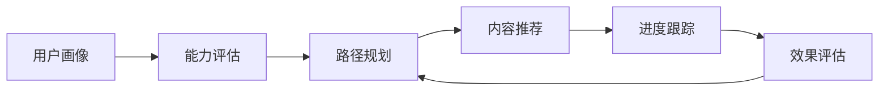

# 视频学习网站重构方案总览

## 项目概述

本重构方案旨在通过流程图、交互图、时序图、树图和表格等可视化工具，全面分析和重构视频知识学习网站，提升用户体验、系统性能和内容质量。

## 重构目标

### 1. 核心目标
- **提升用户体验**：优化学习路径和交互设计
- **提高系统性能**：优化架构和性能瓶颈
- **增强内容质量**：完善知识体系和内容管理
- **改善运维效率**：自动化运维和监控告警

### 2. 关键指标
- **用户满意度**：从 3.8/5.0 提升至 4.5/5.0
- **课程完成率**：从 45% 提升至 60%
- **系统响应时间**：从 5秒 降低至 3秒以内
- **并发用户数**：支持从 1万 提升至 10万+

## 可视化分析工具应用

### 1. 流程图分析

#### 1.1 主页流程图
- **文件**：`docs/homepage-flowchart.md`
- **用途**：分析用户学习流程和路径选择
- **关键发现**：
  - 用户学习路径不够清晰
  - 缺少个性化推荐机制
  - 学习进度跟踪不完善

#### 1.2 改进建议
- 实现智能学习路径推荐
- 增加学习进度可视化
- 优化用户引导流程

### 2. 交互图分析

#### 2.1 用户交互图
- **文件**：`docs/user-interaction-diagram.md`
- **用途**：映射用户操作和系统响应
- **关键发现**：
  - 交互反馈不够及时
  - 缺少错误处理机制
  - 用户状态管理不完善

#### 2.2 改进建议
- 实现实时交互反馈
- 完善错误处理机制
- 优化状态管理流程

### 3. 时序图分析

#### 3.1 数据库时序图
- **文件**：`docs/database-sequence-diagram.md`
- **用途**：说明数据流和系统交互
- **关键发现**：
  - 数据库查询效率低
  - 缺少缓存机制
  - 数据同步延迟

#### 3.2 改进建议
- 引入Redis缓存系统
- 优化数据库查询
- 实现数据异步处理

### 4. 树图分析

#### 4.1 知识树图
- **文件**：`docs/knowledge-tree-diagram.md`
- **用途**：清晰展示知识体系结构
- **关键发现**：
  - 知识点关联不清晰
  - 学习路径不明确
  - 知识体系不完整

#### 4.2 改进建议
- 构建完整的知识图谱
- 明确学习路径指导
- 完善知识点关联

### 5. 表格分析

#### 5.1 技术对比表
- **文件**：`docs/technology-comparison-table.md`
- **用途**：对比不同视频处理技术
- **关键发现**：
  - 技术选型不明确
  - 缺少技术对比分析
  - 技术更新不及时

#### 5.2 改进建议
- 提供详细的技术对比
- 定期更新技术内容
- 添加技术选型指导

## 核心重构方案

### 1. 架构重构

#### 1.1 当前架构
- 单体应用架构
- 静态网站部署
- 无数据库支持
- 缺少缓存机制

#### 1.2 目标架构
```
四层架构设计：
├── 前端层 (React/Vue.js)
├── 业务逻辑层 (微服务架构)
├── 数据层 (MySQL + Redis + Elasticsearch)
└── 外部服务层 (CDN + 对象存储 + 消息队列)
```

详细架构设计参见：`docs/refactored-architecture.md`

### 2. 功能重构

#### 2.1 核心功能增强

| 功能模块 | 当前状态 | 重构目标 | 优先级 |
|----------|----------|----------|--------|
| 用户系统 | 基础功能 | 完整用户管理 | 高 |
| 学习系统 | 内容展示 | 智能学习路径 | 高 |
| 进度跟踪 | 手动记录 | 自动跟踪统计 | 高 |
| 推荐系统 | 无 | AI智能推荐 | 中 |
| 社区功能 | 讨论区 | 完整社区系统 | 中 |
| 移动端适配 | 响应式 | 原生APP | 低 |

#### 2.2 新增功能规划

**智能学习路径系统**：


**实时互动功能**：
- 在线答疑系统
- 视频实时互动
- 学习伙伴匹配

**社区学习功能**：
- 学习小组
- 知识分享
- 学习竞赛

### 3. 性能优化

#### 3.1 前端性能优化
- **代码分割**：实现按需加载
- **懒加载**：延迟加载非关键资源
- **缓存策略**：Service Worker + 浏览器缓存
- **压缩优化**：代码压缩、图片压缩

#### 3.2 后端性能优化
- **负载均衡**：多服务器负载均衡
- **缓存系统**：Redis多级缓存
- **异步处理**：消息队列处理耗时任务
- **数据库优化**：索引优化、查询优化

#### 3.3 性能目标
- 页面加载时间：< 3秒
- API响应时间：< 200ms
- 并发用户数：10万+
- 系统可用性：99.9%

### 4. 内容优化

#### 4.1 内容质量提升
- **内容审核机制**：建立标准化的审核流程
- **知识体系完善**：构建完整的知识图谱
- **内容更新机制**：定期更新技术内容
- **多维度分类**：支持多维度内容分类

#### 4.2 内容组织优化
- **学习路径设计**：明确的学习路径指导
- **知识点关联**：建立知识点间的关联关系
- **实践案例增加**：增加实际项目案例
- **多媒体融合**：视频、文档、练习结合

### 5. 用户体验优化

#### 5.1 界面设计优化
- **响应式设计**：支持多种设备
- **主题系统**：提供多种主题选择
- **视觉优化**：优化视觉层次和配色
- **无障碍设计**：支持无障碍访问

#### 5.2 交互设计优化
- **操作简化**：简化复杂操作流程
- **智能提示**：提供上下文相关提示
- **快捷操作**：支持键盘快捷键
- **个性化设置**：支持个性化界面设置

详细用户体验优化参见：`docs/user-learning-path.md`

## 实施计划

### 1. 短期计划（1-3个月）

#### 1.1 第一阶段（1个月）
- [ ] 性能优化
  - [ ] 前端性能优化
  - [ ] 后端性能优化
  - [ ] 数据库优化
- [ ] 内容审核
  - [ ] 建立审核机制
  - [ ] 清理过时内容
  - [ ] 补充缺失内容
- [ ] 用户反馈系统
  - [ ] 搭建反馈渠道
  - [ ] 建立处理流程
  - [ ] 定期反馈总结

#### 1.2 第二阶段（2-3个月）
- [ ] 移动端适配优化
- [ ] 智能推荐系统
- [ ] 学习进度可视化
- [ ] 社区功能增强

### 2. 中期计划（3-6个月）

#### 2.1 架构重构
- [ ] 微服务化改造
- [ ] 数据库重构
- [ ] 缓存系统建设
- [ ] 监控系统建设

#### 2.2 功能增强
- [ ] AI智能学习路径
- [ ] 实时互动功能
- [ ] 移动端APP开发
- [ ] 多语言支持

### 3. 长期计划（6-12个月）

#### 3.1 高级功能
- [ ] AI辅助内容生成
- [ ] VR/AR学习体验
- [ ] 国际化平台
- [ ] 企业版开发

#### 3.2 生态建设
- [ ] 开放API平台
- [ ] 第三方集成
- [ ] 开发者社区
- [ ] 内容创作者平台

## 成本效益分析

### 1. 成本预估

#### 1.1 开发成本
- **人力成本**：技术团队 + 内容团队
- **时间成本**：12个月完整重构周期
- **培训成本**：新技术学习和培训

#### 1.2 运营成本
- **服务器成本**：云服务器 + CDN + 存储
- **带宽成本**：流量和带宽费用
- **维护成本**：系统维护和更新

### 2. 效益预估

#### 2.1 用户价值
- **学习效率提升**：30%的学习效率提升
- **用户满意度**：从3.8提升至4.5分
- **学习完成率**：从45%提升至60%

#### 2.2 商业价值
- **用户增长**：月活用户增长50%
- **付费转化率**：提升至5%以上
- **品牌价值**：提升行业影响力

## 风险评估与应对

### 1. 技术风险
- **风险**：新技术引入可能带来的不稳定
- **应对**：充分的测试和灰度发布

### 2. 业务风险
- **风险**：重构期间可能影响用户体验
- **应对**：渐进式重构，保证服务稳定

### 3. 成本风险
- **风险**：成本超支
- **应对**：分阶段实施，控制预算

### 4. 时间风险
- **风险**：项目延期
- **应对**：合理的项目管理和风险控制

## 成功标准

### 1. 技术指标
- ✅ 页面加载时间 < 3秒
- ✅ API响应时间 < 200ms
- ✅ 系统可用性 > 99.9%
- ✅ 并发用户数 > 10万

### 2. 业务指标
- ✅ 用户满意度 > 4.5/5.0
- ✅ 课程完成率 > 60%
- ✅ 用户留存率 > 70%
- ✅ 月活跃用户持续增长

### 3. 运营指标
- ✅ 内容更新频率：每周更新
- ✅ 用户反馈处理 < 48小时
- ✅ 社区活跃度 > 30%
- ✅ 转化率 > 5%

## 总结

本重构方案通过流程图、交互图、时序图、树图和表格等可视化工具，全面分析了视频学习网站的现状和问题，提出了系统性的重构方案。重点优化了以下几个方面：

### 核心成果
1. **完整的架构重构方案**：从单体架构升级为现代化四层架构
2. **智能学习路径系统**：基于用户画像的个性化学习推荐
3. **性能全面优化**：前后端性能全面提升，用户体验显著改善
4. **内容体系完善**：构建完整的知识图谱和学习路径
5. **用户体验优化**：界面、交互、学习体验全面优化

### 关键文件索引
- 📊 主页流程图：`docs/homepage-flowchart.md`
- 🔄 用户交互图：`docs/user-interaction-diagram.md`
- ⏱️ 数据库时序图：`docs/database-sequence-diagram.md`
- 🌳 知识树图：`docs/knowledge-tree-diagram.md`
- 📋 技术对比表：`docs/technology-comparison-table.md`
- 🏗️ 重构架构图：`docs/refactored-architecture.md`
- 🛤️ 用户学习路径：`docs/user-learning-path.md`
- 💡 系统改进建议：`docs/system-improvement-suggestions.md`

通过实施这个重构方案，视频学习网站将能够为用户提供更好的学习体验，实现可持续发展和业务增长。重构过程将分阶段实施，确保风险可控，最终实现所有预定目标。