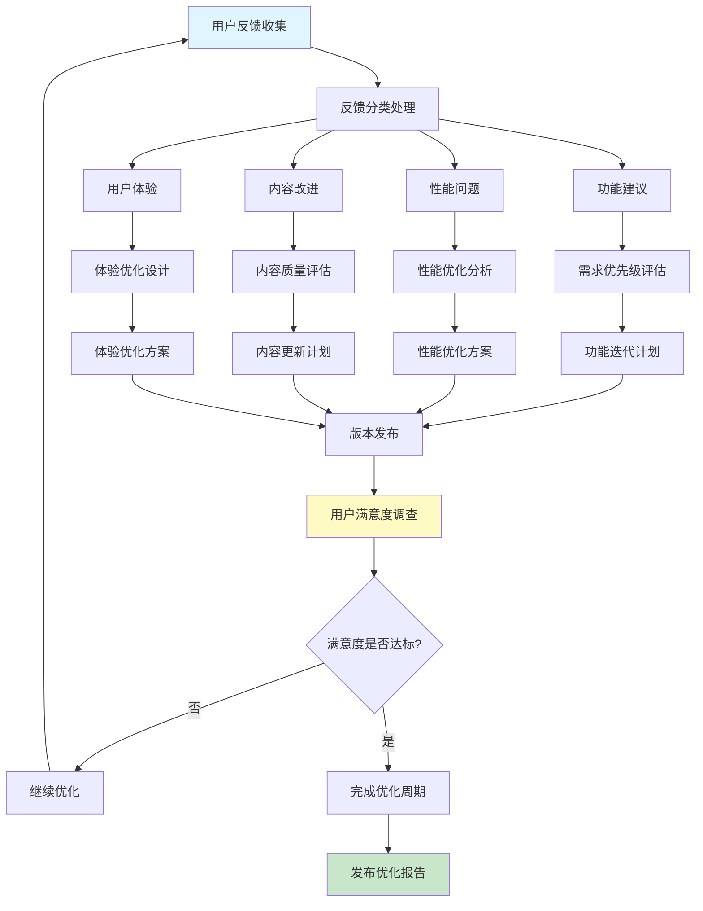
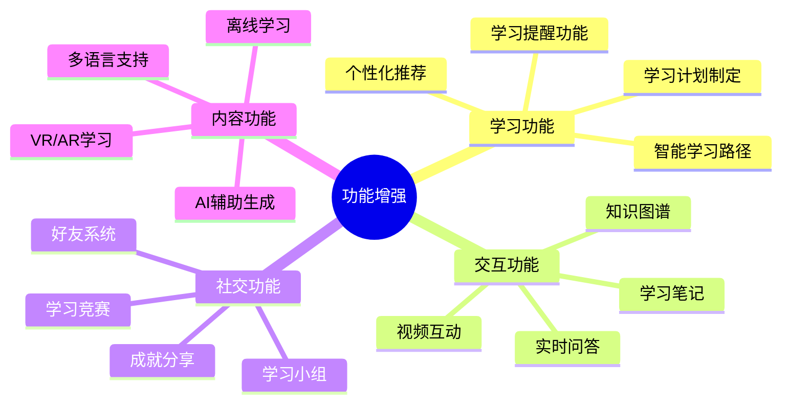
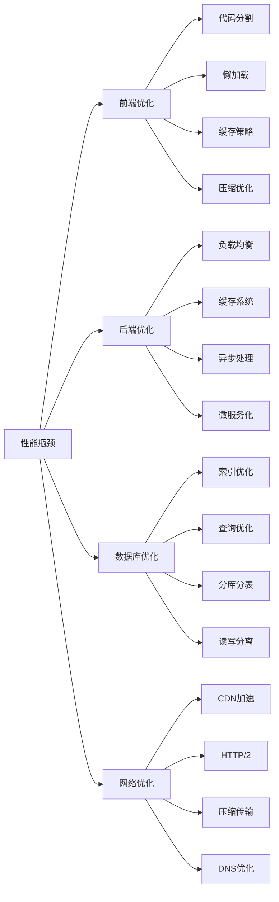
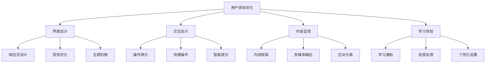
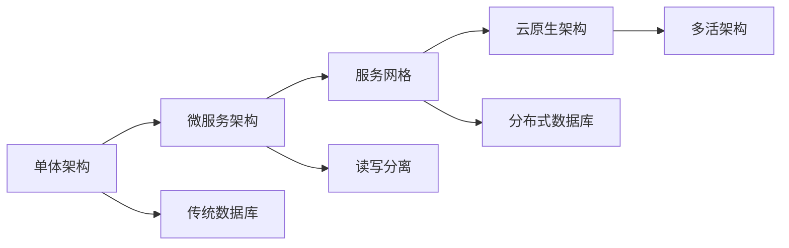
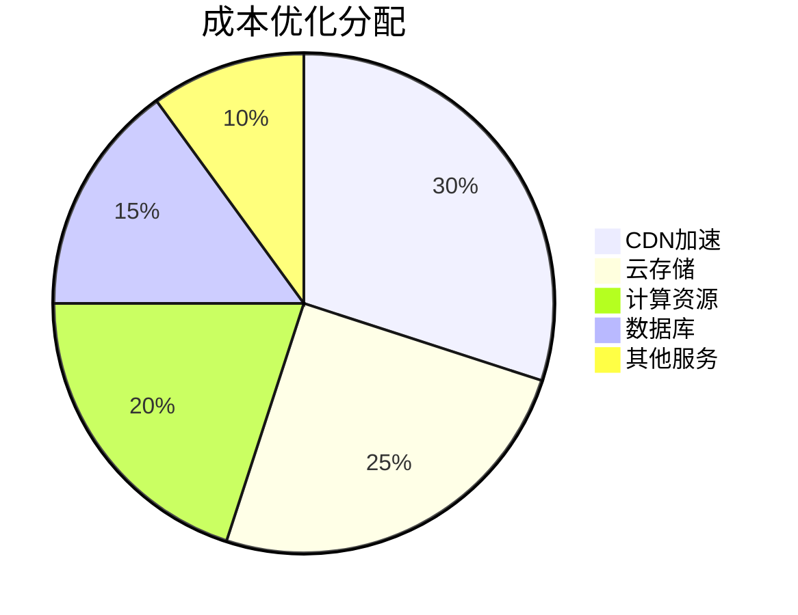

# 系统改进建议与反馈分析

## 系统改进建议说明

### 1. 反馈收集机制

#### 1.1 反馈渠道
- **在线反馈表单**：用户可以直接提交反馈
- **讨论区反馈**：用户在讨论区提出建议
- **客服反馈**：通过客服收集用户意见
- **数据分析**：通过用户行为数据分析发现问题

#### 1.2 反馈类型
- **功能建议**：新功能请求、功能改进建议
- **性能问题**：系统性能问题、加载速度慢
- **内容改进**：内容错误、内容更新请求
- **用户体验**：界面设计、操作流程问题

### 2. 核心改进建议

#### 2.1 功能增强建议

**具体建议**：

1. **智能学习路径系统**
   - 根据用户背景和目标自动规划学习路径
   - 动态调整学习难度和进度
   - 提供个性化的学习建议

2. **实时互动功能**
   - 在线答疑系统
   - 实时视频互动
   - 学习伙伴匹配

3. **学习辅助工具**
   - 智能笔记系统
   - 知识图谱可视化
   - 学习计划工具

4. **社交学习功能**
   - 学习小组功能
   - 学习排行榜
   - 成就分享系统

#### 2.2 性能优化建议

**具体建议**：

1. **前端性能优化**
   - 实现代码分割和懒加载
   - 优化图片和视频加载
   - 使用Service Worker缓存

2. **后端性能优化**
   - 引入Redis缓存系统
   - 实现API限流和熔断
   - 优化数据库查询

3. **视频加载优化**
   - 实现视频分段加载
   - 支持自适应码率
   - 优化视频压缩算法

#### 2.3 内容改进建议

**内容质量提升**：
1. **内容审核机制**
   - 建立内容审核流程
   - 设置内容质量标准
   - 定期更新过时内容

2. **内容多样性**
   - 增加实战项目案例
   - 添加行业应用实例
   - 提供多种学习资源

3. **内容更新频率**
   - 定期更新技术内容
   - 跟踪最新技术发展
   - 用户需求驱动更新

**内容组织优化**：
1. **知识体系完善**
   - 构建完整的知识图谱
   - 建立知识点关联关系
   - 提供学习路径指导

2. **内容分类优化**
   - 多维度内容分类
   - 智能内容推荐
   - 个性化内容排序

#### 2.4 用户体验优化

**具体建议**：

1. **界面设计优化**
   - 实现响应式设计
   - 提供多种主题选择
   - 优化视觉层次

2. **交互设计改进**
   - 简化操作流程
   - 提供快捷操作
   - 添加智能提示

3. **学习体验提升**
   - 游戏化学习机制
   - 实时学习反馈
   - 个性化学习设置

### 3. 技术架构改进

#### 3.1 架构优化建议

**具体建议**：

1. **微服务化改造**
   - 拆分用户服务
   - 拆分学习服务
   - 拆分内容服务
   - 拆分推荐服务

2. **容器化部署**
   - Docker容器化
   - Kubernetes编排
   - 自动扩缩容

3. **监控告警系统**
   - 性能监控
   - 错误监控
   - 业务监控

#### 3.2 安全性增强

**安全措施**：
1. **数据安全**
   - 敏感数据加密
   - 数据备份策略
   - 访问权限控制

2. **网络安全**
   - HTTPS全站加密
   - 防SQL注入
   - 防XSS攻击

3. **业务安全**
   - 防止恶意注册
   - 防止内容盗版
   - 防止数据爬取

### 4. 运营改进建议

#### 4.1 内容运营

**内容策略**：
1. **内容规划**
   - 制定内容更新计划
   - 建立内容审核机制
   - 跟踪技术发展趋势

2. **内容推广**
   - SEO优化
   - 社交媒体推广
   - 技术社区合作

3. **用户运营**
   - 用户激励机制
   - 社区建设
   - 用户反馈处理

#### 4.2 数据运营

**数据分析**：
1. **用户行为分析**
   - 学习行为分析
   - 访问路径分析
   - 流失用户分析

2. **内容效果分析**
   - 内容受欢迎度
   - 学习完成率
   - 用户满意度

3. **业务数据分析**
   - 用户增长趋势
   - 收入分析
   - 成本分析

### 5. 成本优化建议

#### 5.1 资源成本优化

**具体措施**：
1. **CDN优化**
   - 选择合适的CDN服务商
   - 优化CDN缓存策略
   - 减少不必要的流量

2. **云存储优化**
   - 数据分层存储
   - 定期清理无用数据
   - 选择合适的存储类型

3. **计算资源优化**
   - 自动扩缩容
   - 资源利用率监控
   - 按需付费策略

#### 5.2 运维成本优化

**自动化运维**：
1. **自动化部署**
   - CI/CD流水线
   - 自动化测试
   - 自动化发布

2. **自动化监控**
   - 自动告警
   - 自动扩容
   - 自动故障恢复

3. **自动化备份**
   - 定期自动备份
   - 自动备份验证
   - 自动备份清理

### 6. 实施计划

#### 6.1 短期改进计划（1-3个月）

| 改进项目 | 优先级 | 预计时间 | 负责人 |
|----------|--------|----------|--------|
| 性能优化 | 高 | 1个月 | 技术团队 |
| 内容审核 | 高 | 2周 | 内容团队 |
| 用户反馈系统 | 中 | 3周 | 产品团队 |
| 移动端适配 | 中 | 1个月 | 前端团队 |

#### 6.2 中期改进计划（3-6个月）

| 改进项目 | 优先级 | 预计时间 | 负责人 |
|----------|--------|----------|--------|
| 微服务改造 | 高 | 3个月 | 架构团队 |
| 推荐系统 | 中 | 2个月 | 算法团队 |
| 社区功能 | 中 | 2个月 | 产品团队 |
| 多语言支持 | 低 | 3个月 | 内容团队 |

#### 6.3 长期改进计划（6-12个月）

| 改进项目 | 优先级 | 预计时间 | 负责人 |
|----------|--------|----------|--------|
| AI辅助学习 | 高 | 6个月 | AI团队 |
| VR/AR学习 | 中 | 8个月 | 技术团队 |
| 国际化 | 低 | 12个月 | 全团队 |

### 7. 成功指标

#### 7.1 技术指标
- **页面加载速度**：< 3秒
- **系统可用性**：> 99.9%
- **并发用户数**：支持10万+并发
- **错误率**：< 0.1%

#### 7.2 业务指标
- **用户满意度**：> 4.5/5.0
- **课程完成率**：> 60%
- **用户留存率**：> 70%
- **月活跃用户**：持续增长

#### 7.3 运营指标
- **内容更新频率**：每周更新
- **用户反馈处理**：< 48小时响应
- **社区活跃度**：日活用户 > 30%
- **转化率**：> 5%

## 总结

这个系统改进建议基于用户反馈和系统分析，从功能、性能、内容、用户体验等多个维度提出了全面的优化方案。通过分阶段的实施计划，确保改进措施能够有序推进，最终实现用户体验的全面提升和系统性能的持续优化。

关键改进重点：
1. **性能优化**：提升系统响应速度和稳定性
2. **功能增强**：增加智能学习路径和互动功能
3. **内容质量**：提升内容质量和更新频率
4. **用户体验**：优化界面设计和学习体验
5. **成本优化**：通过技术手段降低运营成本

通过持续的改进和优化，网站将能够为用户提供更好的学习体验，实现可持续发展。