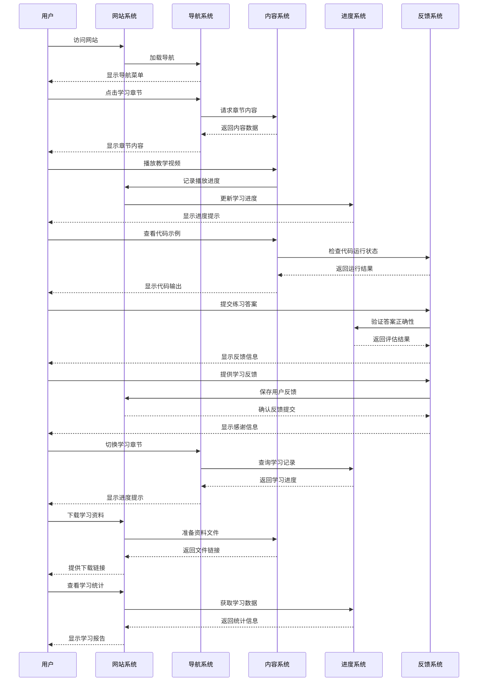

# 视频学习网站用户交互图



## 交互图说明

### 1. 核心交互流程

#### 1.1 网站访问与导航
- **用户访问网站** → **系统加载导航** → **显示导航菜单**
- **用户选择章节** → **系统请求内容** → **显示章节内容**

#### 1.2 学习内容交互
- **播放视频** → **记录进度** → **显示进度提示**
- **查看代码示例** → **检查运行状态** → **显示输出结果**

#### 1.3 练习与反馈
- **提交练习答案** → **验证正确性** → **显示反馈信息**
- **提供学习反馈** → **保存用户反馈** → **显示感谢信息**

#### 1.4 学习管理
- **切换章节** → **查询学习记录** → **显示进度提示**
- **下载资料** → **准备文件** → **提供下载链接**
- **查看统计** → **获取学习数据** → **显示学习报告**

### 2. 系统组件职责

#### 2.1 导航系统 (N)
- 管理网站导航菜单
- 处理用户章节选择
- 显示学习进度提示

#### 2.2 内容系统 (C)
- 提供章节学习内容
- 管理视频播放
- 处理代码示例展示

#### 2.3 进度系统 (P)
- 记录学习进度
- 验证练习答案
- 生成学习统计报告

#### 2.4 反馈系统 (F)
- 处理用户练习提交
- 收集用户反馈
- 提供学习建议

### 3. 交互设计原则

#### 3.1 响应式设计
- 所有操作都有明确反馈
- 进度实时更新
- 错误处理友好提示

#### 3.2 数据流管理
- 学习数据持久化存储
- 进度自动同步
- 反馈及时处理

#### 3.3 用户体验优化
- 平滑的页面切换
- 即时的操作响应
- 清晰的状态指示

### 4. 关键交互场景

#### 4.1 学习流程
```
用户选择章节 → 系统加载内容 → 用户学习 → 系统记录进度 → 用户继续学习
```

#### 4.2 练习流程
```
用户完成练习 → 系统验证答案 → 提供反馈 → 用户查看结果 → 系统更新进度
```

#### 4.3 反馈流程
```
用户提交反馈 → 系统保存数据 → 确认提交 → 用户查看结果
```

### 5. 性能优化考虑

#### 5.1 异步处理
- 视频播放不阻塞其他操作
- 进度记录后台处理
- 反馈提交异步处理

#### 5.2 缓存策略
- 导航信息本地缓存
- 学习进度本地缓存
- 常用内容预加载

### 6. 错误处理机制

#### 6.1 网络错误
- 离线状态下的操作处理
- 网络恢复后的同步机制

#### 6.2 数据错误
- 无效的练习答案处理
- 错误的反馈内容处理

#### 6.3 系统错误
- 视频播放失败的替代方案
- 代码运行错误的友好提示

## 总结

这个交互图展示了视频学习网站的核心用户交互流程，确保了用户在学习过程中的顺畅体验。通过清晰的组件分工和完善的错误处理机制，网站能够提供稳定可靠的学习服务。