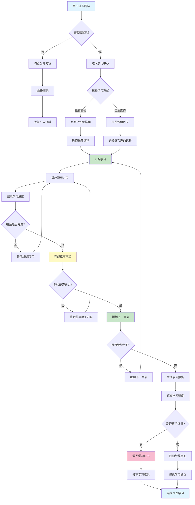
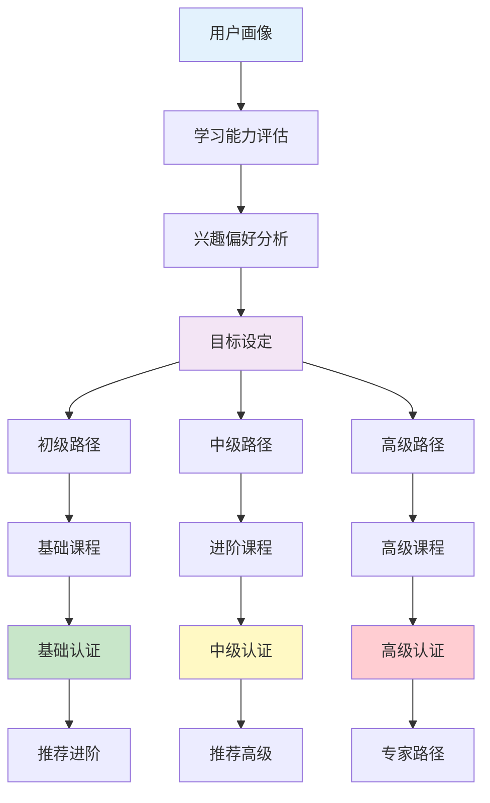
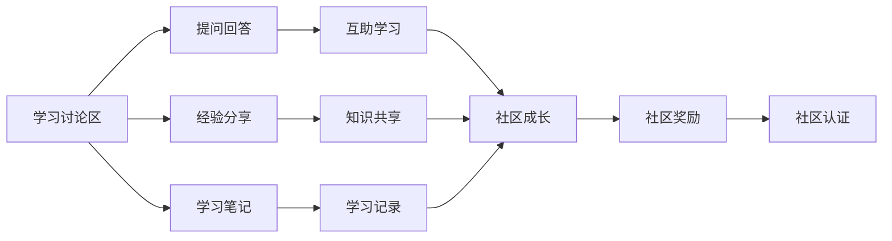

# 用户学习路径追踪图



## 用户学习路径说明

### 1. 用户入口流程

#### 1.1 新用户流程
```
进入网站 → 浏览公开内容 → 注册登录 → 完善资料 → 开始学习
```

#### 1.2 老用户流程
```
进入网站 → 自动登录 → 进入学习中心 → 继续学习
```

### 2. 学习方式选择

#### 2.1 推荐路径
- **系统推荐**：根据用户画像推荐适合的课程
- **热门推荐**：展示最受欢迎的课程
- **必学路径**：按照学习路径推荐课程

#### 2.2 自主选择
- **课程目录**：浏览所有课程分类
- **搜索查找**：搜索感兴趣的内容
- **标签筛选**：按标签筛选课程

### 3. 学习过程跟踪

#### 3.1 视频学习
```
播放视频 → 记录进度 → 暂停/继续 → 完成学习
```

#### 3.2 章节测验
```
完成视频 → 参加测验 → 验证答案 → 通过/重学
```

#### 3.3 进度管理
```
记录进度 → 保存状态 → 同步数据 → 生成报告
```

### 4. 学习成果输出

#### 4.1 学习报告
- **学习时长统计**：总学习时间、每日学习时间
- **完成度分析**：课程完成率、章节完成情况
- **知识掌握度**：测验成绩、知识点掌握情况

#### 4.2 学习证书
- **证书颁发**：完成课程后颁发证书
- **技能认证**：验证用户技能水平
- **成就展示**：展示学习成果

### 5. 个性化学习路径



### 6. 学习路径优化

#### 6.1 自适应学习
- **难度调整**：根据测验结果调整课程难度
- **内容推荐**：推荐相关的补充材料
- **学习建议**：提供个性化的学习建议

#### 6.2 学习效率优化
- **间隔学习**：推荐最佳的复习时间
- **重点强化**：强化薄弱知识点
- **实战练习**：提供实践机会

### 7. 学习数据分析

#### 7.1 行为数据
- **访问时长**：用户在网站停留时间
- **学习频率**：每周学习次数
- **完成率**：课程完成情况

#### 7.2 学习效果
- **测验成绩**：各章节测验成绩
- **知识掌握**：知识点掌握程度
- **技能提升**：技能水平提升情况

#### 7.3 学习偏好
- **学习时间**：偏好的学习时间段
- **学习方式**：视频、文档、练习偏好
- **内容类型**：理论、实践、项目偏好

### 8. 用户激励系统

#### 8.1 积分系统
- **学习积分**：学习获得积分奖励
- **测验积分**：通过测验获得积分
- **互动积分**：讨论、分享获得积分

#### 8.2 成就系统
- **学习徽章**：完成特定任务获得徽章
- **等级提升**：积累积分提升等级
- **排行榜**：展示用户学习排名

#### 8.3 奖励机制
- **学习证书**：完成课程获得证书
- **学习资料**：积分兑换学习资料
- **特殊权限**：高级用户特权

### 9. 学习社区互动



### 10. 学习路径可视化

#### 10.1 进度可视化
- **学习进度条**：直观显示学习进度
- **知识地图**：展示知识点掌握情况
- **学习轨迹**：显示学习路径和时间线

#### 10.2 成果可视化
- **技能树**：展示已掌握的技能
- **证书展示**：展示获得的证书
- **学习报告**：可视化学习报告

## 总结

这个用户学习路径追踪系统通过详细的流程设计和数据分析，实现了：

1. **个性化学习**：根据用户画像推荐学习路径
2. **进度跟踪**：实时记录和同步学习进度
3. **效果评估**：通过测验验证学习效果
4. **激励机制**：积分、徽章、证书激励学习
5. **社区互动**：讨论区、笔记、分享功能
6. **数据驱动**：通过数据分析优化学习路径

系统设计注重用户体验和学习效果，通过科学的路径设计和激励机制，帮助用户高效学习视频处理技术。