# 从入门到精通：计算机视频技术全景指南

> 视频技术已经渗透到我们生活的方方面面，从短视频平台到在线教育，从视频会议到影视制作，了解视频处理技术变得越来越重要。本文将带你全面了解视频处理的知识体系，从基础概念到前沿AI技术，从编解码原理到在线视频架构，为你构建完整的视频技术知识地图。

---

## 一、视频处理技术全景图

视频处理技术是一个庞大而复杂的知识体系，涵盖了从底层原理到上层应用的方方面面。为了帮助大家建立清晰的知识框架，我们先来看一下整个技术体系的全貌。

```mermaid
graph TB
    A[视频处理技术] --> B[基础知识]
    A --> C[编解码技术]
    A --> D[AI视频处理]
    A --> E[在线视频技术]
    A --> F[工具框架]
    A --> G[代码实践]
    
    B --> B1[视频基本概念]
    B --> B2[色彩空间]
    B --> B3[图像处理]
    B --> B4[运动估计]
    
    C --> C1[H.264/AVC]
    C --> C2[H.265/HEVC]
    C --> C3[AV1/VP9]
    C --> C4[编码优化]
    
    D --> D1[神经编码]
    D --> D2[视频理解]
    D --> D3[视频生成]
    D --> D4[视频增强]
    
    E --> E1[流媒体协议]
    E --> E2[直播技术]
    E --> E3[CDN分发]
    E --> E4[ABR技术]
    
    F --> F1[FFmpeg]
    F --> F2[OpenCV]
    F --> F3[PyTorchVideo]
    F --> F4[GStreamer]
    
    G --> G1[Python示例]
    G --> G2[Golang示例]
    G --> G3[项目实战]
    
    style A fill:#667eea,color:#fff
    style B fill:#f3e5f5
    style C fill:#c8e6c9
    style D fill:#fff9c4
    style E fill:#bbdefb
    style F fill:#ffccbc
    style G fill:#d1c4e9
```

### 推荐学习路径

对于初学者来说，按照科学的学习路径可以事半功倍。以下是推荐的学习路线：

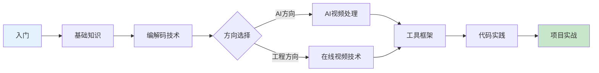

| 学习阶段 | 主要内容 | 预计时间 | 难度 |
|---------|---------|---------|------|
| 基础知识 | 视频概念、色彩、图像处理 | 1-2周 | ⭐⭐ |
| 编解码技术 | 主流编码标准、压缩原理 | 2-3周 | ⭐⭐⭐ |
| AI视频处理 | 神经编码、视频理解、生成 | 3-4周 | ⭐⭐⭐⭐ |
| 在线视频技术 | 流媒体、CDN、直播技术 | 2-3周 | ⭐⭐⭐ |
| 工具框架 | FFmpeg、OpenCV、PyTorchVideo | 2-3周 | ⭐⭐⭐ |
| 代码实践 | 实际项目开发 | 持续 | ⭐⭐⭐⭐ |

---

## 二、基础知识篇

### 2.1 视频基本概念

要理解视频处理，首先要掌握几个核心概念：

**视频参数关系图**

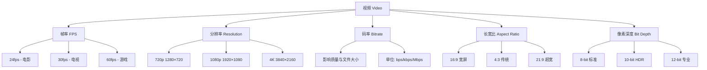

这些参数相互影响，共同决定了视频的质量和文件大小：

| 参数 | 定义 | 常见值 | 影响 |
|------|------|--------|------|
| 帧率 (FPS) | 每秒显示帧数 | 24/30/60/120 | 流畅度、文件大小 |
| 分辨率 | 视频空间尺寸 | 720p/1080p/4K/8K | 清晰度、文件大小 |
| 码率 | 每秒数据量 | 1-50+ Mbps | 画质、文件大小 |
| 像素深度 | 每像素位数 | 8/10/12 bit | 色彩精度 |

### 2.2 色彩空间与转换

视频处理中最重要的概念之一就是色彩空间。不同的色彩空间适用于不同的应用场景：

**RGB与YUV色彩空间对比**

RGB色彩空间是加色模型，由红(R)、绿(G)、蓝(B)三个分量组成，适合显示设备。而YUV色彩空间是亮色分离模型，包含亮度(Y)和色度(U/V)分量，更适合视频压缩。


**RGB → YUV 转换公式 (BT.601)**

```
Y  = 0.299R + 0.587G + 0.114B
U  = -0.169R - 0.331G + 0.500B + 128
V  = 0.500R - 0.419G - 0.081B + 128
```

**色度采样格式**

为了节省带宽，视频压缩中通常会对色度分量进行下采样：

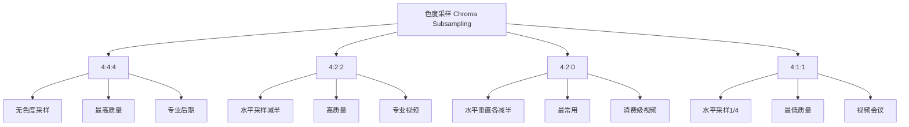

### 2.3 容器格式与编码格式

初学者经常混淆容器格式和编码格式。简单来说，容器像是一个包装盒，而编码则是盒子里面的物品。

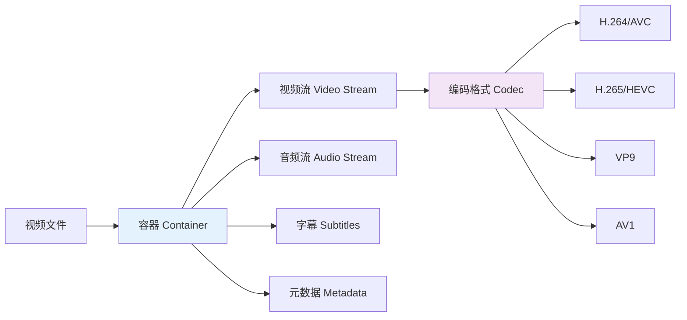

常见容器格式对比：

| 容器格式 | 特点 | 支持编码 | 应用场景 |
|---------|------|---------|---------|
| MP4 | 兼容性最好，广泛支持 | H.264, H.265, AAC | 网络视频、移动设备 |
| MKV | 开源，支持多轨道 | 几乎所有编码 | 高清电影、多语言 |
| WebM | Web优化，免费开源 | VP9, AV1, Opus | HTML5视频 |
| MOV | Apple格式，质量高 | H.264, ProRes | Apple设备、专业制作 |

### 2.4 图像处理基础

视频本质上是一系列图像的序列，因此图像处理是视频处理的基础。

**图像处理方法分类**

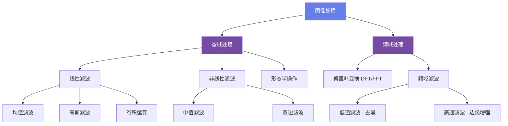

线性滤波和非线性滤波各有优势：

- **线性滤波**：均值滤波、高斯滤波，特点是可以分离、速度快，适合简单平滑
- **非线性滤波**：中值滤波、双边滤波，特点是可以保护边缘细节，适合去椒盐噪声

### 2.5 运动估计与运动补偿

视频压缩的核心技术之一就是利用时间冗余，即相邻帧之间的相关性。运动估计和运动补偿就是利用这种相关性来减少数据量。

**运动估计原理**

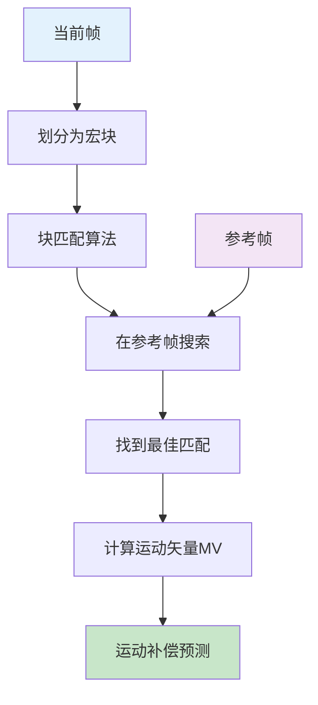

常用的块匹配算法对比：

| 搜索算法 | 搜索点数 | 精度 | 速度 |
|---------|---------|------|------|
| 全搜索 | 最多 | 最高 | 最慢 |
| 三步搜索 | 25点 | 中等 | 快 |
| 钻石搜索 | 较少 | 较高 | 很快 |
| 六边形搜索 | 少 | 高 | 最快 |

### 2.6 帧类型与GOP结构

视频编码中使用不同类型的帧来平衡压缩效率和随机访问能力。

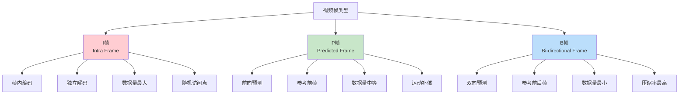

GOP (Group of Pictures) 是一组图像序列，典型结构如 IBBPBBPBBP：

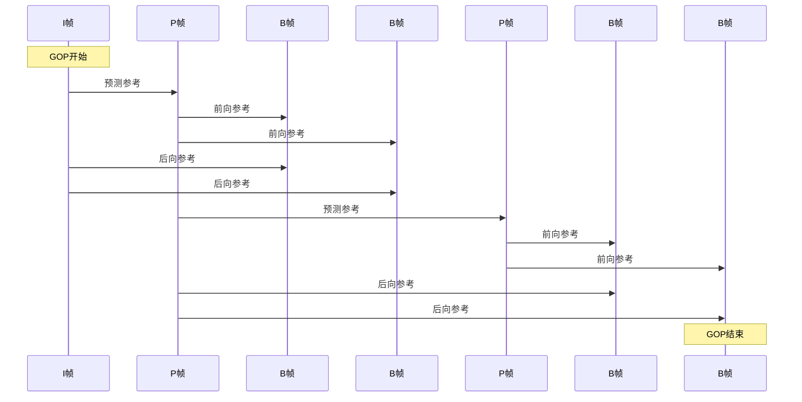

### 2.7 视频质量评估

如何衡量视频压缩后的质量是一个重要的问题。

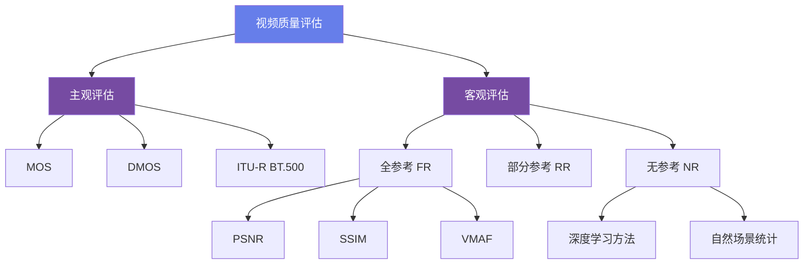

常用的质量评估指标：

| 指标 | 公式/说明 | 范围 | 应用 |
|------|----------|------|------|
| PSNR | 10·log₁₀(MAX²/MSE) | >30dB 可接受 | 编码质量评估 |
| SSIM | 结构相似性指数 | [0, 1] | 感知质量评估 |
| VMAF | Netflix多方法融合 | [0, 100] | 流媒体质量 |
| MOS | 平均意见分 | [1, 5] | 主观测试 |

---

## 三、编解码技术篇

### 3.1 主流编码标准对比

目前主流的视频编码标准有哪些？它们各有什么优缺点？

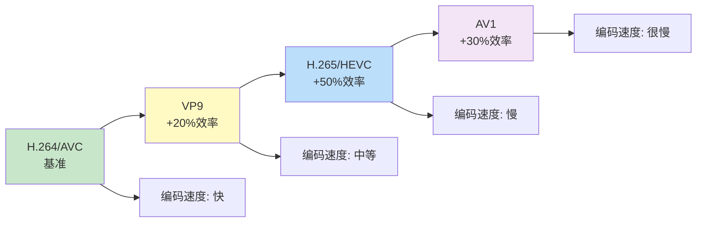

主流编码标准对比表：

| 特性 | H.264/AVC | H.265/HEVC | AV1 | VP9 |
|------|-----------|------------|-----|-----|
| 发布年份 | 2003 | 2013 | 2018 | 2013 |
| 开发组织 | ITU-T/ISO | ITU-T/ISO | AOMedia | Google |
| 专利授权 | 💰 收费 | 💰 收费 | ✅ 免费 | ✅ 免费 |
| 压缩效率 | 基准 | +50% | +30% | +20% |
| 编码复杂度 | ⭐⭐⭐ | ⭐⭐⭐⭐⭐ | ⭐⭐⭐⭐⭐⭐ | ⭐⭐⭐⭐ |
| 硬件支持 | ✅ 广泛 | ✅ 良好 | ⚠️ 发展中 | ✅ 良好 |
| 应用场景 | 实时通讯、直播 | 4K/8K视频 | 流媒体平台 | WebRTC |

### 3.2 H.264/AVC 详解

H.264是目前应用最广泛的视频编码标准，它的编码架构是理解现代视频编码的基础。

**H.264编码架构**

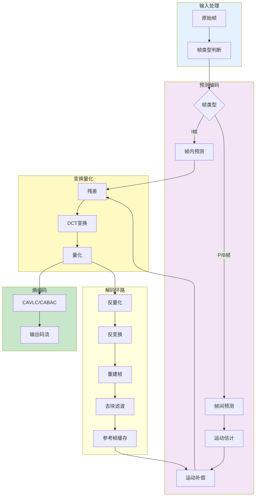

H.264的核心技术包括：

- **帧内预测**：4×4块有9种模式，16×16块有4种模式，利用空间相关性
- **帧间预测**：运动估计精度达1/4像素，支持最多16个参考帧
- **熵编码**：CAVLC较简单，CABAC压缩率更高

### 3.3 H.265/HEVC 详解

H.265是H.264的继任者，在相同画质下可以节省50%的带宽。

**H.265 vs H.264 技术对比**

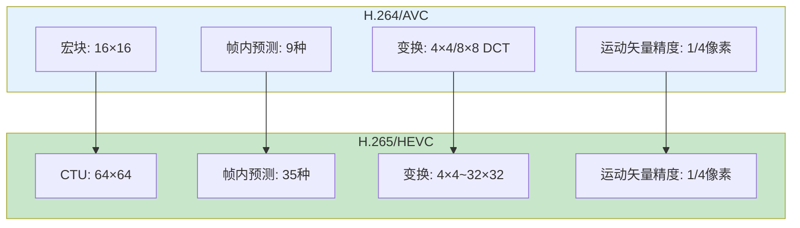

H.265的主要改进：

| 技术特性 | H.264 | H.265 | 改进 |
|---------|-------|-------|------|
| 编码单元 | 宏块 16×16 | CTU 64×64 | 更灵活的分割 |
| 帧内预测 | 9种模式 | 35种模式 | 更精细的方向 |
| 变换尺寸 | 4×4, 8×8 | 4×4 ~ 32×32 | 更大变换块 |
| 并行工具 | 有限 | Tile/WPP | 更好的并行 |
| 环路滤波 | 去块滤波 | 去块+SAO | 减少伪影 |

### 3.4 AV1 编码标准

AV1是AOMedia联盟开发的免费开源视频编码标准，目标是提供比H.265更好的压缩效率，同时避免专利费用。

**AV1编码特性**

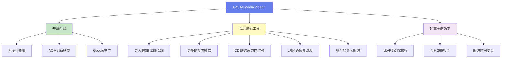

AV1的应用现状：

- **YouTube**：支持AV1编码播放
- **Netflix**：部分内容采用AV1
- **浏览器支持**：Chrome、Firefox、Edge原生支持
- **硬件解码**：新一代GPU逐步支持

### 3.5 视频编码通用流程

尽管不同编码标准的技术细节不同，但它们都遵循类似的混合编码框架。

**混合编码框架完整流程**

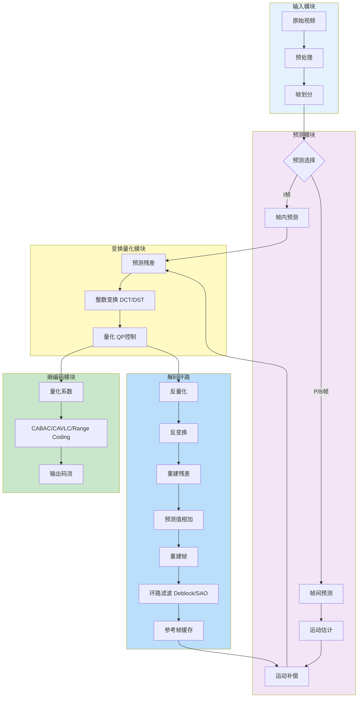

编码核心四步骤：**预测 → 变换 → 量化 → 熵编码**

---

## 四、AI视频处理篇

### 4.1 AI视频技术全景图

人工智能正在深刻改变视频处理技术，从压缩到理解，从生成到增强，AI技术无处不在。

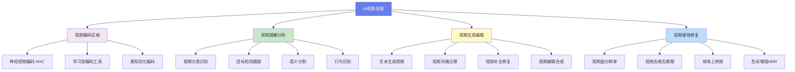

### 4.2 神经视频编码 (NVC)

神经视频编码是AI在视频压缩领域的前沿应用，通过深度学习替代传统手工设计的变换和预测算法。

**传统编码 vs 神经编码对比**

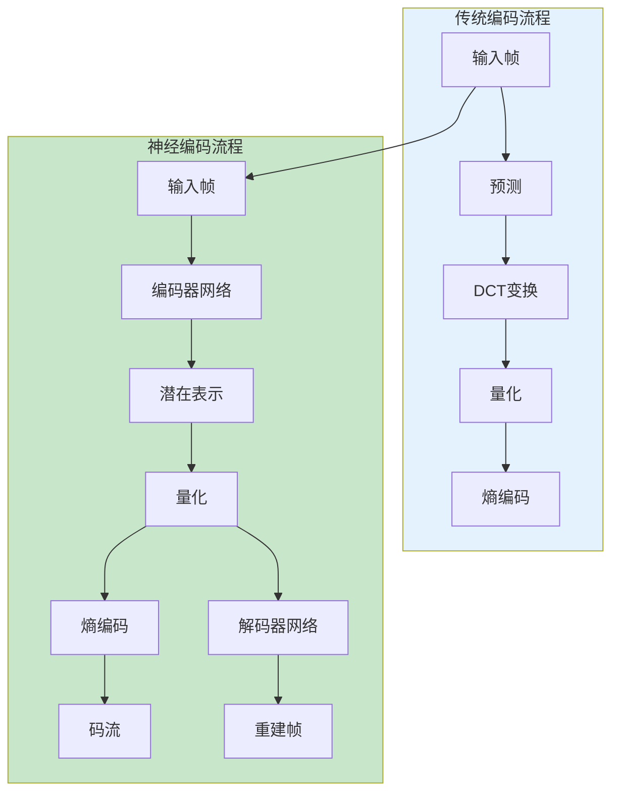

神经编码的关键技术：

- **超先验模型**：学习潜在表示的概率分布
- **感知损失**：基于人眼视觉感知优化
- **率失真优化**：联合优化码率和质量
- **注意力机制**：自适应关注重要区域

### 4.3 视频理解与检索

视频理解是AI技术的重要应用领域，包括分类、检测、跟踪、分割等任务。

**视频理解任务分类**

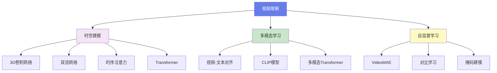

主流视频理解模型对比：

| 模型架构 | 特点 | 适用任务 | 代表模型 |
|---------|------|---------|---------|
| 3D CNN | 时空联合卷积 | 动作识别 | I3D, SlowFast |
| 双流网络 | RGB + 光流 | 动作识别 | Two-Stream |
| Video Transformer | 全局时空注意力 | 多任务 | ViViT, TimeSformer |
| 多模态模型 | 视频-文本对齐 | 检索、生成 | CLIP4Clip, VideoMAE |

### 4.4 视频生成与编辑

近年来，视频生成技术取得了突破性进展，从早期的GAN到现在的Diffusion模型，生成质量不断提升。

**视频生成技术发展历程**

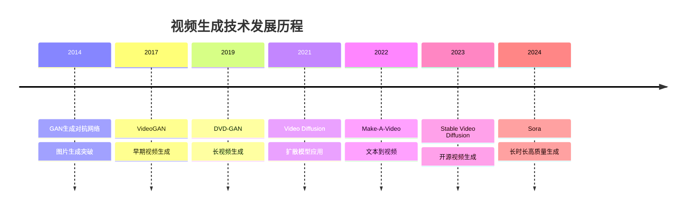

**Diffusion视频生成流程**

```mermaid
flowchart TB
    subgraph Training["训练阶段"]
        T1[视频数据] --> T2[前向扩散]
        T2 --> T3[添加噪声]
        T3 --> T4[噪声视频]
        T4 --> T5[反向去噪]
        T5 --> T6[去噪网络U-Net]
        T6 --> T7[预测噪声]
    end
    
    subgraph Generation["生成阶段"]
        G1[随机噪声] --> G2[条件输入<br/>文本/图像]
        G2 --> G3[迭代去噪]
        G3 --> G4[去噪网络]
        G4 --> G5[中间结果]
        G5 --> G3
        G3 --> G6[生成视频]
    end
    
    T6 -.-> G4
    
    style Training fill:#e3f2fd
    style Generation fill:#c8e6c9
```

视频生成技术对比：

| 生成方法 | 优点 | 缺点 | 适用场景 |
|---------|------|------|---------|
| GAN | 生成速度快 | 训练不稳定、模式崩溃 | 短视频 |
| Diffusion | 生成质量高、训练稳定 | 计算成本高 | 高质量视频 |
| Autoregressive | 长序列建模、连贯性好 | 生成慢 | 长视频生成 |

### 4.5 视频增强技术

视频增强技术可以提升视频质量，包括超分辨率、去噪、去模糊、帧率上转换等。

**视频超分辨率流程**

```mermaid
flowchart LR
    A[低分辨率视频] --> B[帧提取]
    B --> C[特征提取网络]
    C --> D[时序对齐]
    D --> E[特征融合]
    E --> F[上采样网络]
    F --> G[高分辨率视频]
    
    H[参考帧] --> D
    
    style A fill:#e3f2fd
    style G fill:#c8e6c9
```

主流视频增强任务：

| 增强任务 | 输入 | 输出 | 代表方法 |
|---------|------|------|---------|
| 超分辨率 | 低分辨率视频 | 高分辨率视频 | EDVR, Real-ESRGAN |
| 视频去噪 | 噪声视频 | 清晰视频 | ViDeNN, FastDVDNet |
| 帧率上转换 | 低帧率视频 | 高帧率视频 | DAIN, RIFE |
| 去模糊 | 模糊视频 | 清晰视频 | DeblurGAN, ESTRNN |
| HDR转换 | SDR视频 | HDR视频 | HDRTVNet |

---

## 五、在线视频技术篇

### 5.1 流媒体系统架构

在线视频系统涉及采集、处理、分发、播放等多个环节，是一个复杂的系统工程。

**在线视频系统完整架构**

```mermaid
graph TB
    subgraph Source["内容源"]
        A1[摄像头采集]
        A2[文件上传]
        A3[屏幕录制]
    end
    
    subgraph Ingest["内容采集"]
        B1[推流端<br/>推流SDK]
        B2[转码服务]
    end
    
    subgraph Processing["内容处理"]
        C1[实时转码]
        C2[多码率编码]
        C3[封装封装]
        C4[内容加密]
    end
    
    subgraph Distribution["内容分发"]
        D1[CDN边缘节点]
        D2[负载均衡]
        D3[缓存服务]
    end
    
    subgraph Playback["播放端"]
        E1[Web播放器]
        E2[移动App]
        E3[智能电视]
    end
    
    Source --> Ingest
    Ingest --> Processing
    Processing --> Distribution
    Distribution --> Playback
    
    style Source fill:#e3f2fd
    style Processing fill:#f3e5f5
    style Distribution fill:#fff9c4
    style Playback fill:#c8e6c9
```

系统组件与关键技术：

| 系统组件 | 核心功能 | 关键技术 | 性能指标 |
|---------|---------|---------|---------|
| 采集推流 | 音视频采集编码 | RTMP/WebRTC推流 | 延迟 < 1秒 |
| 转码处理 | 多码率转码 | FFmpeg/GPU加速 | 实时处理 |
| CDN分发 | 内容加速分发 | 边缘缓存、智能调度 | 命中率 > 95% |
| 播放器 | 解码渲染播放 | HLS/DASH/FLV | 首屏 < 2秒 |

### 5.2 流媒体协议详解

不同的流媒体协议有不同的特点和适用场景。

**主流流媒体协议对比**

```mermaid
graph TB
    A[流媒体协议] --> B[RTMP]
    A --> C[HLS]
    A --> D[DASH]
    A --> E[WebRTC]
    
    B --> B1[基于TCP]
    B --> B2[低延迟直播]
    B --> B3[Flash推流]
    
    C --> C1[基于HTTP]
    C --> C2[Apple标准]
    C --> C3[m3u8+ts切片]
    
    D --> D1[基于HTTP]
    D --> D2[国际标准]
    D --> D3[mpd+m4s切片]
    
    E --> E1[基于UDP]
    E --> E2[P2P传输]
    E --> E3[实时通信]
    
    style A fill:#667eea,color:#fff
    style B fill:#f3e5f5
    style C fill:#c8e6c9
    style D fill:#fff9c4
    style E fill:#bbdefb
```

流媒体协议对比表：

| 协议 | 传输层 | 延迟 | 特点 | 应用场景 |
|------|--------|------|------|---------|
| RTMP | TCP | 2-5秒 | 低延迟、Flash生态 | 直播推流 |
| HLS | HTTP | 5-30秒 | 兼容性好、防火墙穿透 | 点播、直播 |
| DASH | HTTP | 5-30秒 | 开放标准、灵活 | 点播服务 |
| WebRTC | UDP | < 500ms | 超低延迟、P2P | 视频会议 |
| SRT | UDP | 1-3秒 | 抗丢包、低延迟 | 专业直播 |

**HLS协议工作流程**

```mermaid
sequenceDiagram
    participant C as 客户端
    participant S as 服务器
    participant CDN as CDN节点
    
    C->>S: 请求m3u8播放列表
    S->>C: 返回m3u8索引
    Note over C: 解析播放列表
    
    loop 播放循环
        C->>CDN: 请求TS切片
        CDN->>C: 返回TS视频片段
        Note over C: 解码播放
        C->>C: 检测带宽
        C->>S: 请求合适码率m3u8
        S->>C: 返回新m3u8
    end
    
    Note over C,CDN: 自适应码率切换
```

### 5.3 直播技术架构

直播技术是流媒体应用的重要场景，需要考虑低延迟、高并发、稳定性等问题。

**直播系统完整流程**

```mermaid
flowchart LR
    A[主播端] --> B[推流<br/>RTMP]
    B --> C[流媒体服务器]
    C --> D[实时转码]
    D --> E[切片封装]
    E --> F[HLS/DASH流]
    F --> G[CDN分发]
    G --> H[边缘节点]
    H --> I[观众端播放]
    
    C --> J[录制存储]
    J --> K[点播回放]
    
    style A fill:#e3f2fd
    style I fill:#c8e6c9
```

直播关键技术指标：

- **首屏时间**：从点击到画面显示，目标 < 2秒
- **端到端延迟**：从采集到播放，传统5-10秒，低延迟 < 2秒
- **抗卡顿**：缓冲区管理、码率自适应
- **高并发**：CDN分发、P2P加速

### 5.4 CDN内容分发网络

CDN是提升视频服务质量的关键技术，通过边缘节点缓存内容，就近服务用户。

**CDN分发架构**

```mermaid
graph TB
    subgraph Origin["源站"]
        O1[流媒体服务器]
        O2[存储系统]
    end
    
    subgraph CDN["CDN网络"]
        C1[中心节点]
        C2[区域节点]
        C3[边缘节点]
    end
    
    subgraph Users["用户端"]
        U1[北京用户]
        U2[上海用户]
        U3[广州用户]
        U4[海外用户]
    end
    
    O1 --> C1
    C1 --> C2
    C2 --> C3
    
    C3 --> U1
    C3 --> U2
    C3 --> U3
    C3 --> U4
    
    O1 -.-> O2
    
    style Origin fill:#e3f2fd
    style CDN fill:#fff9c4
    style Users fill:#c8e6c9
```

CDN优势：

- 就近访问降低延迟
- 减轻源站压力
- 提高带宽利用率
- 增强抗攻击能力

缓存策略：

- 热点内容预缓存
- TTL过期机制
- LRU淘汰算法
- 动态回源策略

### 5.5 自适应码率技术 (ABR)

自适应码率技术可以根据网络状况动态调整视频码率，在保证流畅播放的同时尽可能提供更好的画质。

**ABR自适应码率切换流程**

```mermaid
sequenceDiagram
    participant P as 播放器
    participant N as 网络监测
    participant A as ABR算法
    participant CDN as CDN服务器
    
    P->>N: 持续监测网络状态
    N->>A: 上报带宽、延迟、丢包
    A->>A: 计算最优码率
    
    alt 网络变差
        A->>P: 切换到低码率
        P->>CDN: 请求低码率切片
        CDN->>P: 返回低码率视频
    else 网络变好
        A->>P: 切换到高码率
        P->>CDN: 请求高码率切片
        CDN->>P: 返回高码率视频
    end
    
    Note over P,CDN: 无缝切换，不中断播放
```

主流ABR算法对比：

| ABR算法 | 原理 | 优点 | 缺点 |
|---------|------|------|------|
| 吞吐量算法 | 基于带宽预测 | 实现简单 | 带宽波动敏感 |
| 缓冲区算法 | 基于缓冲区水位 | 稳定性好 | 响应较慢 |
| 混合算法 | 带宽+缓冲区 | 平衡性好 | 参数调优复杂 |
| 学习型算法 | 机器学习预测 | 适应性强 | 训练成本高 |

---

## 六、工具框架篇

### 6.1 FFmpeg - 多媒体处理瑞士军刀

FFmpeg是功能最强大的多媒体处理工具，几乎可以处理所有的音视频格式。

**FFmpeg处理流程**

```mermaid
flowchart LR
    A[输入文件] --> B[Demuxer解封装]
    B --> C[Decoder解码]
    C --> D[Filter滤镜处理]
    D --> E[Encoder编码]
    E --> F[Muxer封装]
    F --> G[输出文件]
    
    style A fill:#e3f2fd
    style G fill:#c8e6c9
```

FFmpeg常用功能：

| 功能类别 | 常用命令 | 应用场景 |
|---------|---------|---------|
| 格式转换 | ffmpeg -i input.mp4 output.avi | 容器格式转换 |
| 编码转换 | -c:v libx264 -c:a aac | 编码标准转换 |
| 剪辑处理 | -ss 00:00:10 -t 60 | 截取视频片段 |
| 滤镜处理 | -vf "scale=1280:720" | 缩放、裁剪、水印 |
| 流提取 | -vn -acodec copy | 提取音频流 |

### 6.2 OpenCV - 计算机视觉库

OpenCV是最流行的计算机视觉库，支持Python和C++接口，功能丰富且易于使用。

**OpenCV视频处理模块**

```mermaid
graph TB
    A[OpenCV] --> B[VideoCapture]
    A --> C[Image Processing]
    A --> D[Object Detection]
    
    B --> B1[视频读取]
    B --> B2[摄像头采集]
    B --> B3[帧处理]
    
    C --> C1[滤波去噪]
    C --> C2[边缘检测]
    C --> C3[形态学操作]
    
    D --> D1[人脸检测]
    D --> D2[目标跟踪]
    D --> D3[特征提取]
    
    style A fill:#667eea,color:#fff
```

OpenCV的优势：

- 跨平台支持
- 丰富的算法库
- Python/C++接口
- 开源免费

### 6.3 工具对比与选型

不同的工具适合不同的应用场景，合理选型可以提高开发效率。

工具对比表：

| 工具 | 语言 | 主要用途 | 优势 | 适用场景 |
|------|------|---------|------|---------|
| FFmpeg | C | 多媒体处理 | 功能全面、性能高 | 转码、流媒体 |
| OpenCV | C++/Python | 计算机视觉 | 算法丰富、易用 | CV应用 |
| PyTorchVideo | Python | 深度学习 | 预训练模型 | AI研究 |
| GStreamer | C | 流媒体框架 | 模块化、灵活 | 专业应用 |
| MediaPipe | C++/Python | 机器学习 | 跨平台、实时 | 移动应用 |

选型建议：

- **转码处理**：FFmpeg（命令行）或GStreamer（编程）
- **实时CV**：OpenCV + Python/C++
- **深度学习**：PyTorch Video / TensorFlow
- **移动应用**：MediaPipe / OpenCV Mobile

---

## 七、代码实践篇

### 7.1 Python视频处理流程

Python是视频处理开发中最常用的语言，拥有丰富的库和工具。

**OpenCV视频处理流程**

```mermaid
flowchart TD
    A[导入库<br/>import cv2] --> B[打开视频<br/>VideoCapture]
    B --> C{读取帧<br/>read}
    C -->|成功| D[处理帧<br/>图像处理]
    D --> E[显示/保存<br/>imshow/imwrite]
    E --> C
    C -->|结束| F[释放资源<br/>release]
    
    style A fill:#e3f2fd
    style F fill:#c8e6c9
```

核心代码示例：

```python
import cv2

# 打开视频文件或摄像头
cap = cv2.VideoCapture('video.mp4')  # 或 0 表示摄像头

while cap.isOpened():
    ret, frame = cap.read()
    if not ret:
        break
    
    # 图像处理
    gray = cv2.cvtColor(frame, cv2.COLOR_BGR2GRAY)
    edges = cv2.Canny(gray, 100, 200)
    
    # 显示结果
    cv2.imshow('Edges', edges)
    if cv2.waitKey(1) & 0xFF == ord('q'):
        break

cap.release()
cv2.destroyAllWindows()
```

### 7.2 Golang视频处理流程

Golang以其高性能和并发能力，在服务端视频处理中越来越受欢迎。

**FFmpeg-go处理架构**

```mermaid
graph TB
    A[Go应用] --> B[ffmpeg-go绑定]
    B --> C[FFmpeg命令构建]
    C --> D[输入源配置]
    D --> E[滤镜链配置]
    E --> F[编码参数设置]
    F --> G[输出配置]
    G --> H[执行转码]
    
    style A fill:#e3f2fd
    style H fill:#c8e6c9
```

Python vs Golang对比：

| 特性 | Python | Golang |
|------|--------|--------|
| 开发速度 | 快 | 中等 |
| 执行性能 | 中等 | 高 |
| 并发支持 | GIL限制 | 原生协程 |
| 生态系统 | 丰富 | 成长中 |
| 部署方式 | 依赖较多 | 单二进制 |

### 7.3 视频处理项目开发流程

完整的视频处理项目开发需要遵循科学的流程。

**完整开发流程**

```mermaid
flowchart LR
    A[需求分析] --> B[技术选型]
    B --> C[环境搭建]
    C --> D[原型开发]
    D --> E[功能实现]
    E --> F[性能优化]
    F --> G[测试验证]
    G --> H[部署上线]
    
    E --> I[遇到问题]
    I --> J[查阅文档]
    J --> K[社区求助]
    K --> E
    
    style A fill:#e3f2fd
    style H fill:#c8e6c9
```

开发阶段与关键任务：

| 开发阶段 | 关键任务 | 常用工具 |
|---------|---------|---------|
| 需求分析 | 明确功能、性能要求 | 文档、原型工具 |
| 技术选型 | 选择合适框架和工具 | FFmpeg、OpenCV等 |
| 原型开发 | 快速验证可行性 | Python脚本 |
| 性能优化 | 提升处理速度 | 多线程、GPU加速 |
| 测试验证 | 功能测试、压力测试 | 单元测试、集成测试 |
| 部署上线 | 容器化、监控 | Docker、K8s |

---

## 八、总结与展望

视频处理技术是一个不断发展演进的领域，从早期的MPEG到现在的AI编码，从传统流媒体到实时互动，技术边界不断拓展。

### 技术发展趋势

1. **AI深度融合**：神经编码、视频理解、生成式AI将持续改变视频技术
2. **更高压缩效率**：AV1、VVC等新一代编码标准将提供更好的压缩率
3. **更低延迟**：WebRTC、LL-HLS等技术推动超低延迟直播普及
4. **沉浸式体验**：8K、HDR、VR/AR带来更丰富的视觉体验
5. **边缘计算**：边缘AI推理、实时处理能力提升

### 学习建议

对于想要深入学习视频技术的开发者，建议：

1. **打好基础**：扎实掌握视频编码的基本原理和数学基础
2. **动手实践**：使用FFmpeg、OpenCV等工具进行实际开发
3. **关注前沿**：跟踪AI视频处理、新编码标准等前沿技术
4. **社区交流**：参与开源项目、技术社区，与他人交流学习
5. **项目驱动**：通过实际项目来巩固和深化知识

---

**视频处理技术既有深度又有广度，既有理论又有实践。希望本文能够为你提供一份全面的学习指南，帮助你在这个领域不断成长。**

如果你有任何问题或建议，欢迎留言交流！